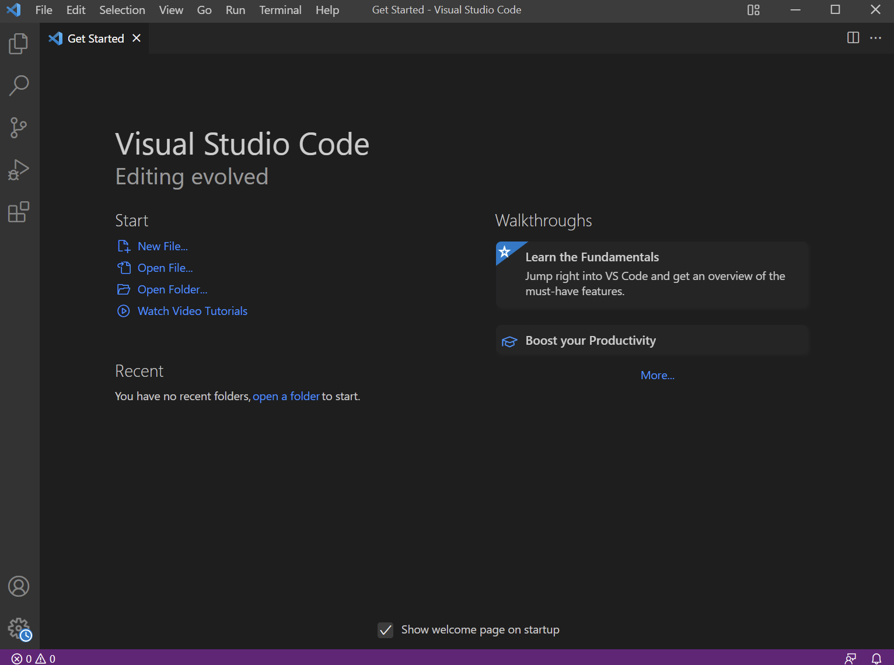
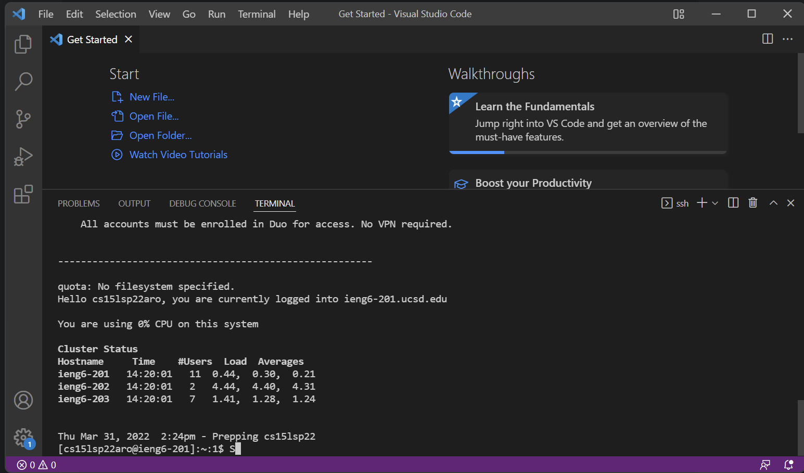
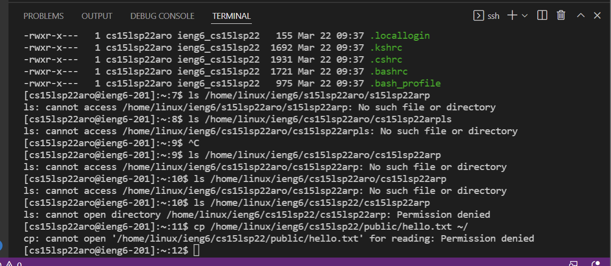
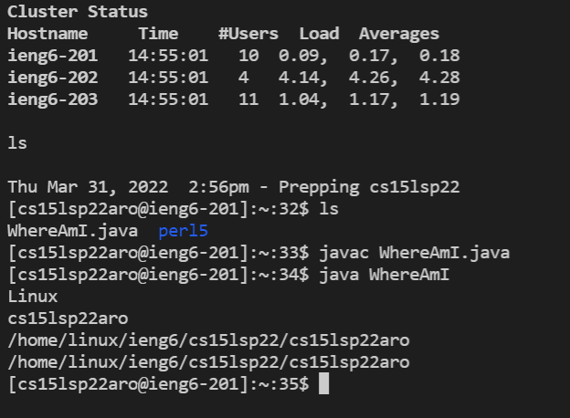
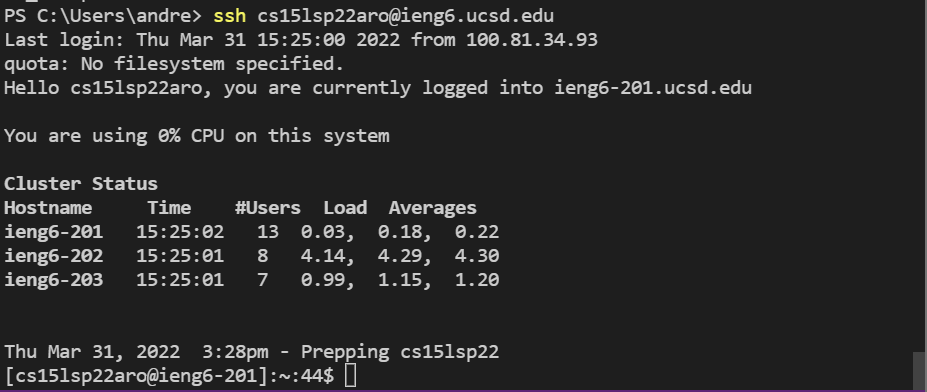

# **Week 2 Lab Report 1**

## *1. Installing VS Code*

To get Visual Studio Code, I went to [VS Code](https://code.visualstudio.com/), and downloaded it for windows. Once installed, the page looked like the picture above.

## *2. Remotely Connecing*

As a windows user, I had to install OpenSSH.

Afterwards, in VSCode, I typed in `$ ssh cs15lsp22zz@ieng6.ucsd.edu` while replacing the `zz`'s with my own specific code. I found my own code on [Account lookup](https://sdacs.ucsd.edu/~icc/index.php).

After I said yes to the question, I typed my password and was logged in.

## *3. Trying Some Commands*

There are multiple commands to try such as `cd`, `ls`, `pwd`, `mkdir`, and `cp`.

I found that `ls -l` stands for public, `ls -a` stands for hidden, `ls -la` stands for hidden and public, and `ls -lat` stand for all long and hidden plus the time it was added. 

In addition to that, `cat` command views files or creates files. If there is no permission, access is denied.

## *4. Moving Files with `scp`*

Using the command, `scp WhereAmI.java cs15lsp22zz@ieng6.ucsd.edu:~/` where WhereAmI.java can be any file.

It should prompt you for your password and once entered, the file should have moved into your remote SSH server.

## *5. Setting an SSH Key*

After typing `$ ssh-keygen`, it will generate a public/private rsa key pair and then ask for the file in which to save the key like so:
`(/Users/<user-name>/.ssh/id_rsa): /Users/<user-name>/.ssh/id_rsa`

The next step is to copy the public version of the key to the .ssh directory of the server. Using `$ mkdir .ssh` and `$ scp /Users/<user-name>/.ssh/id_rsa.pub
cs15lsp22zz@ieng6.ucsd.edu:~/.ssh/authorized_keys`

Afterwards, I no longer needed to use a password.

## *6. Optimized Remote Running*
When writing commands ot make local edits to then move to the remote server, there are some coding shortcuts that make things faster. For example, using `$ ssh cs15lsp22zz@ieng6.ucsd.edu "<commands>"` will log into the remote server and simultaneously run the command.
