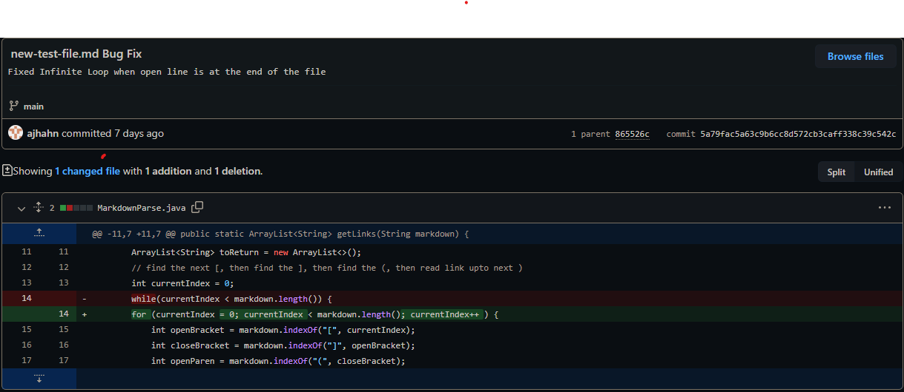
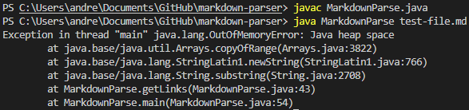
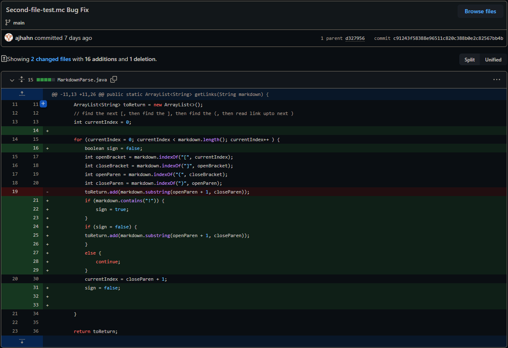
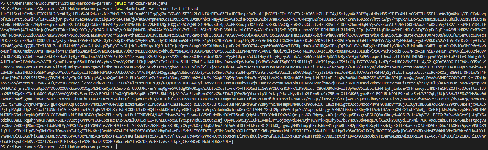
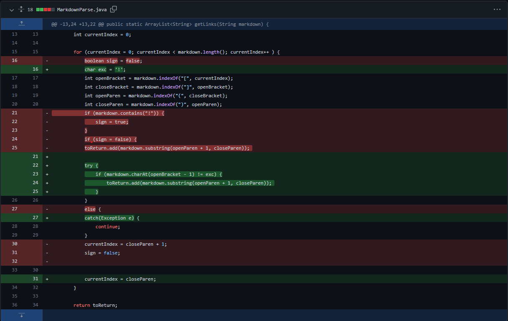
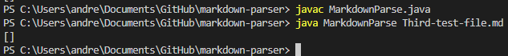

# **Week 4 Lab Report 2**

## *1. Bug Fix 1*

Click the following [Link](https://github.com/ajhahn/markdown-parser/blob/main/new-test-file.md) to see the test file for a failure-inducing input.

The first bug was due to a blank line appearing at the end of an md file. The symptom of the bug was that the while loop would continue forever until the java heap space would run out. The failure inducing input consisted of an md file with a link followed by a blank line at the end of the file. 

Extra explanation for future me: The while loop consisted of currentIndex < markdown.length(). Because currentIndex only indexes whenever there is a closeParen, it would get stuck in the loop forever. Using a for loop instead, insures that no matter what, the currentIndex will always index and eventually reach an end.

## *2. Bug Fix 2*

Click the following [Link](https://github.com/ajhahn/markdown-parser/blob/main/second-test-file.md) to see the test file for a failure-inducing input.

The second bug was due to the markdown parser not differentiating between regular links and image links. The symptom of the bug was that it would print out the image link when I did not want it to. The failure inducing input consisted of an md file with an image link in it. 

Extra explanation for future me: I added a boolean to catch if the markdown parser has a "!". If it does, the boolean would be set to true. A future if statement checks if the boolean value is false. If false, it would run normally, but if the boolean value was true, it would continue the loop without adding the link. The end of the loop resets the boolean value to false.

## *3. Bug Fix 3*

Click the following [Link](https://github.com/ajhahn/markdown-parser/blob/main/Third-test-file.md) to see the test file for a failure-inducing input.

The third bug was due to the markdown parser not counting links that would follow an image link. The symptom of the bug was that it would print out a blank list even if a link was in the md file. The failure inducing input consisted of an md file with an image link in it followed by a regular link. 

Extra explanation for future me: I added a char that held the "!" sign. I then removed the if statements from before and added a try and catch statement instead. If the character before the open bracket was not a "!", then it would be added to the list. If the index it was checking was out of bounds or was a "!", then the loop would catch the exception and continue once again. 