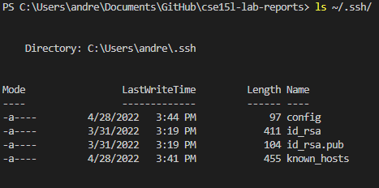
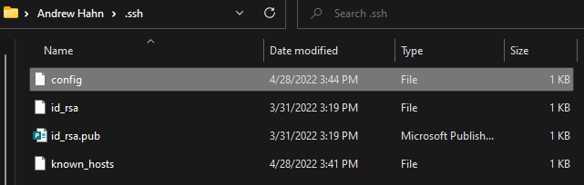
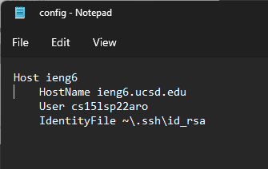
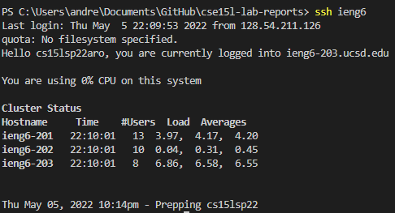
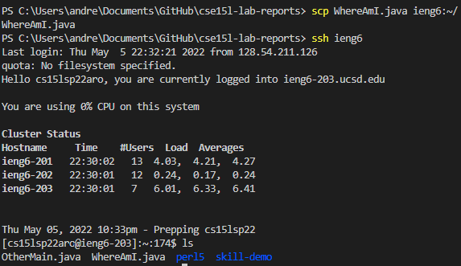

# **Week 6 Lab Report 3**

## *1. Streamlining ssh Configuration*

I navigate to my .ssh file to find the config file. I then open it with Notepad to edit it.

Using `ssh ieng6`, I can log in much faster.

Using `scp WhereAmI.java ieng6`, I can copy the file to my remote account.

## *2. Setup Github Access from ieng6*
test for 

## *3. Copy whole directories with `scp -r`*