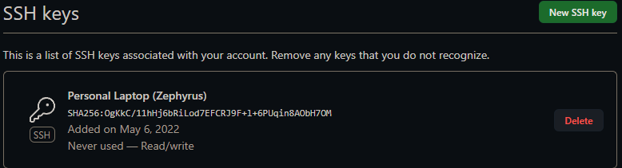
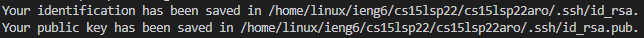
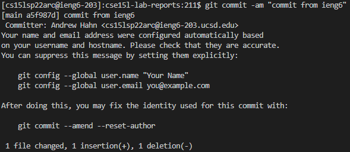
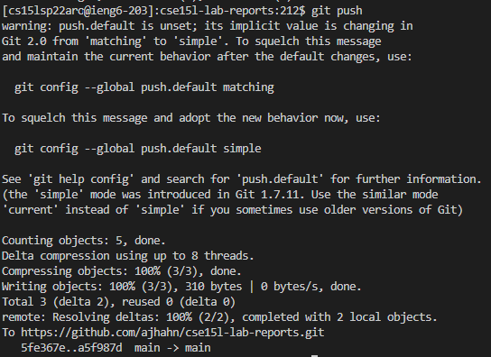

# **Week 6 Lab Report 3**

## *1. Streamlining ssh Configuration*

I navigate to my .ssh file to find the config file. I then open it with Notepad to edit it.

Using `ssh ieng6`, I can log in much faster.

Using `scp WhereAmI.java ieng6`, I can copy the file to my remote account.

## *2. Setup Github Access from ieng6*

This is the public key on Github.

These are where my private and public keys are stored on my user account.

Now I am able to commit and push changes from my ieng6 account and if you click this [Link](https://github.com/ajhahn/cse15l-lab-reports/commit/a5f987d7a38ec5110556f3174d9cfae960af9c50), you can see the changes for the resulting commit.

## *3. Copy whole directories with `scp -r`*