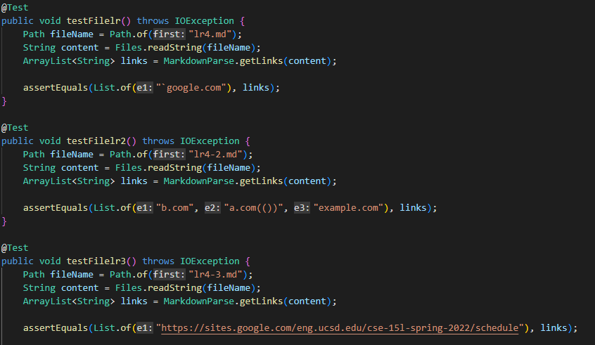
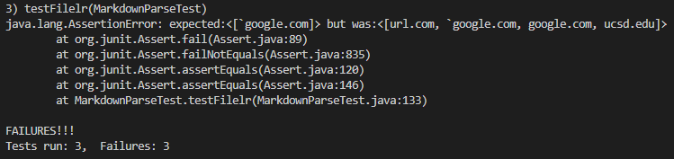
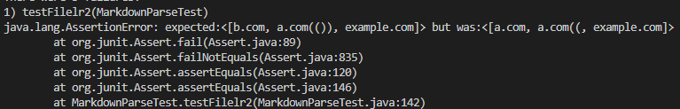
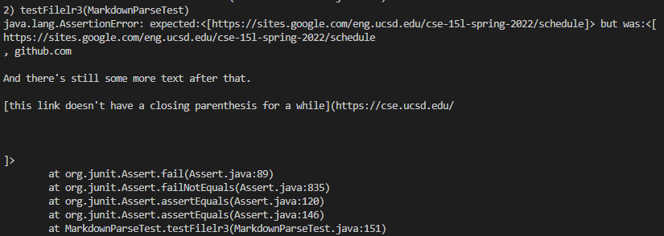
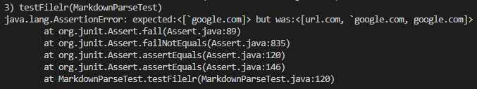
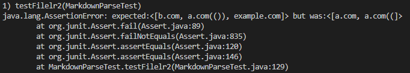
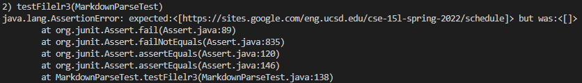

# **Week 8 Lab Report 4**

## *Expected Snippet Output*

For snippet 1, the expected output should be [`google.com].

For snippet 2, the expected output should be [b.com, a.com(()), example.com]

For snippet 3, the expected output should be [https://sites.google.com/eng.ucsd.edu/cse-15l-spring-2022/schedule].

For both my repository and the reviewed repository, these are the tests written for the different text file snippets.

## *My Repository Output*
Here is a link to [My Repository](https://github.com/ajhahn/markdown-parser).
For my repository's output, all 3 tests failed.

## *Reviewed Repository Output*
Here is the link to the [Reviewed Repository](https://github.com/ryankosta/good-markdown-parser). For the reviewed repository's output, all 3 tests also failed.

## *Question 1*
Do you think there is a small (<10 lines) code change that will make your program work for snippet 1 and all related cases that use inline code with backticks? 

I feel like there would be a small code change that will make the program work with inline code and backticks. After locating the brackets, I feel like it would be possible to check if there are backticks directly before, inside, and directly after the brackets to make the program work.

## *Question 2*
Do you think there is a small (<10 lines) code change that will make your program work for snippet 2 and all related cases that nest parentheses, brackets, and escaped brackets? 

I feel like there would need to be a more involved change in order to make the program work for snippet 2 and all related cases. In order to solve this, I feel like there would be a need to check if there is an additional bracket and cancel the corresponding closed bracket until the original closed bracket is reached. I feel like a change this complicated would not be possible in under 10 lines of code.

## *Question 3*
Do you think there is a small (<10 lines) code change that will make your program work for snippet 3 and all related cases that have newlines in brackets and parentheses?

I feel liek there is a small code change that would be possible to make the program work for snippet 3 and all related cases. In locating brackets and parenthesis, I feel that checking if the immediately next spot is the expected symbol would work well.

