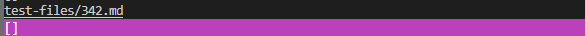

# **Week 10 Lab Report 5**

## *How I found the tests with different results*

In order to find how my test results differed from cse15lsp22-markdown-parser's results, I first added some code to script.sh to save the output of each parser to a file. In doing so, I had two text files that had each markdown-parser's results. Afterwards, I simply used vimdiff (`vimdiff markdown-parser/results.txt cse15lsp22-markdown-parser/results.txt`) on both text files in order to find the tests with different results.

## *Link to the test-file with different-results*

Here is the link to [Test-File 194](https://github.com/nidhidhamnani/markdown-parser/blob/main/test-files/194.html.test) and [Test-File 342](https://github.com/nidhidhamnani/markdown-parser/blob/main/test-files/342.html.test)

## *Test-File 194*

For Test-File 194, I believe that neither implementation is correct. These are the outputs of both my markdown-parser and cse15l22sp-markdown-parser.

The correct output would just be an empty list because there should be no links. For cse15l22sp-markdown-parser's implementation, I think the error is that it just sees that url is inside a pair of parenthesis so it counts it as a link. It doesn't check if there are brackets prior to the parenthesis. In the code, this is where it would need to be fixed. I feel like this problem is not small enough to pinpoint a certain highlighted area that specifically could solve this problem.

## *Test-File 342*

For Test-File 342, I believe that my implementation is correct while cse15l22sp-markdown-parser's is incorrect. These are the outputs of both my markdown-parser and cse15l22sp-markdown-parser.

The correct output would just be an empty list because there should be no links. For cse15l22sp-markdown-parser's implementation, I think the error is that it still sees that /foo is inside a pair of parenthesis so it counts it as a link. Without checking for any other cases, all it looks for are words inside of a pair of parenthesis. In the code, this is where it would need to be fixed. I feel like this problem is not small enough to pinpoint a certain highlighted area that specifically could solve this problem.

While both Test-Files 194 and 342 require code change sto the place where cse15l22sp-markdown-parser marks down links, the changes required, while similar, are different.
